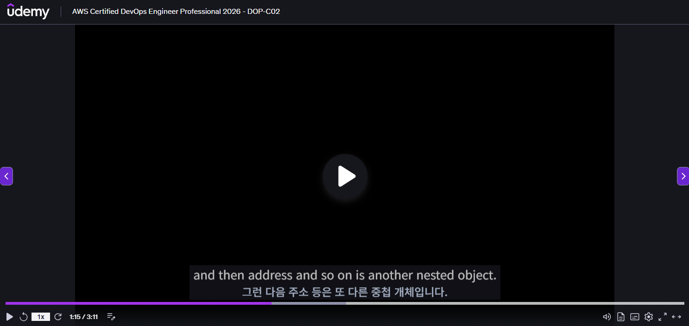
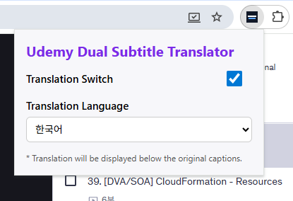

# Udemy Dual Subtitle Translator (Chrome Extension)

This Chrome extension translates Udemy lecture captions into a selected language and renders dual subtitles below the original captions.

## Screenshots

## Features

- Translation ON/OFF toggle
- Select target language
- Render translated captions below the original (dual subtitles)
- Reuse cached translations for repeated sentences
- Prefetch VTT captions to reduce perceived latency
- Automatically ignore sprite VTTs (thumb-sprites)

## Tech Stack

- TypeScript
- React
- Vite
- Chrome Extension Manifest V3

## Quick Start

1. Install dependencies
   - `npm install`
2. Build
   - `npm run build`
3. Open `chrome://extensions` in Chrome
4. Enable **Developer mode** (top right)
5. **Load unpacked** → select the `dist` folder
6. Verify the extension icon appears

## Usage

1. Open a Udemy lecture page.
2. Click the extension icon and enable translation.
3. Select the target language.
4. Translated captions appear below the original captions automatically.

## Dev Reload (Auto Refresh)

Watches `dist` build output and reloads the extension automatically.

1. Start build watch
   - `npm run build:watch`
2. Start reload server
   - `npm run reload:server`
3. Load the `dist` folder in Chrome Extensions

When the Udemy page is open, changes are applied automatically.

## Icon Assets

- Location: `public/icons/`
- Files: `icon-16.png`, `icon-32.png`, `icon-48.png`, `icon-128.png`
- Referenced by `manifest.json` under `icons` and `action.default_icon`

## Permissions

- `storage`: store user settings
- `https://www.udemy.com/*`: access Udemy lecture pages
- `https://translate.googleapis.com/*`: call translation API
- `http://localhost:35729/*`: dev reload server (dev only)

## How It Works

- The content script watches Udemy caption DOM changes.
- It detects VTT caption URLs and prefetches upcoming captions in the background.
- The background service worker calls the translation API and stores results in cache.
- Translated text is rendered into the caption container.

## Technical Details

- VTT detection
  - Detects `.vtt` requests from `<track>` tags or `performance` resources.
  - Excludes sprite VTTs containing `thumb-sprites` or `xywh` patterns.
- Prefetch policy
  - Prefetch runs only while video is playing.
  - Skips requests when `currentTime` is not advancing to reduce noise.
- Cache strategy
  - Translation results are stored in LRU caches.
  - Both content and background caches have max size limits.
- Text normalization
  - Normalizes whitespace and removes speaker labels to improve VTT-caption matching.

## Notes

- If Udemy changes its DOM structure, selectors may need updates.
- Behavior may vary based on translation API availability/policy.

## Contributing

- Issues/PRs welcome. Please include a short description and screenshots where relevant.
- Code should pass `npm run build`.

## License

- MIT License
