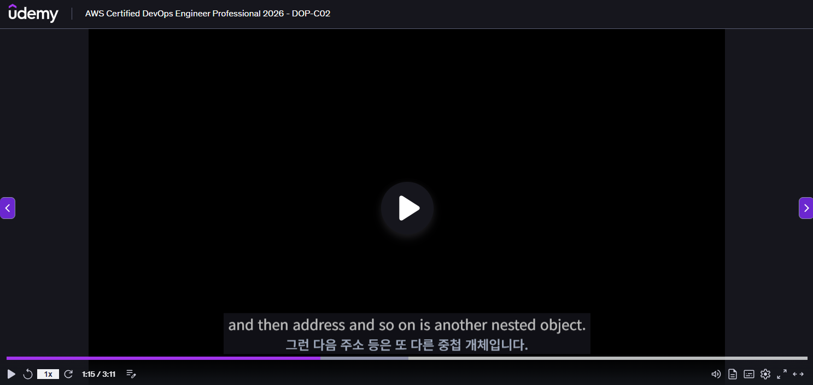

<div align="center">

# Udemy Dual Subtitle Translator (Chrome Extension)


</div>

This Chrome extension translates Udemy lecture captions into a selected language and renders dual subtitles below the original captions.

## Screenshots

<div align="center">




</div>

## Features

- Translation ON/OFF toggle
- Select target language
- Preserve Terms (custom glossary): keep specified terms untranslated
- Popup UI localization (auto follows browser locale)
- Localized extension metadata via Chrome i18n
- Auto technical-term protection with token scoring (reduces over-protection)
- Render translated captions below the original (dual subtitles)
- Reuse cached translations for repeated sentences
- Prefetch VTT captions to reduce perceived latency
- Automatically ignore sprite VTTs (thumb-sprites)
- Polling-based watch mode for stable file change detection on WSL/mounted drives

## UI Localization Update

- Added Chrome i18n workflow to `public/manifest.json` with `default_locale` and `__MSG_...__` placeholders.
- Added popup localization helper in `src/popup/i18n.ts` using `chrome.i18n.getMessage` and UI language resolution.
- Replaced hard-coded popup strings in `src/popup/App.tsx` with locale lookup fallbacks.
- Added built-in locale bundles:
  - `public/_locales/en/messages.json`
  - `public/_locales/ko/messages.json`
  - `public/_locales/ja/messages.json`
- Added `popup.html` language/title baseline values aligned to extension locale behavior.

## Tech Stack

- TypeScript
- React
- Vite
- Chrome Extension Manifest V3

## Quick Start

1. Install dependencies
   - `npm install`
2. Build
   - `npm run build`
3. Open `chrome://extensions` in Chrome
4. Enable **Developer mode** (top right)
5. **Load unpacked** → select the `dist` folder
6. Verify the extension icon appears

## Usage

1. Open a Udemy lecture page.
2. Click the extension icon and enable translation.
3. Select the target language.
4. (Optional) Add terms in **Preserve Terms** (one per line) to keep them in original form.
5. Translated captions appear below the original captions automatically.

### Supported UI locales

- `en` (default)
- `ko`
- `ja`

To add another locale, add `public/_locales/<locale>/messages.json` and define the same keys used by the popup.

Minimal locale schema example:

```json
{
  "extensionName": { "message": "..." },
  "extensionDescription": { "message": "..." },
  "actionTitle": { "message": "..." },
  "popupTitle": { "message": "..." },
  "popupTitleHeading": { "message": "..." },
  "popupSubhead": { "message": "..." },
  "translationToggle": { "message": "..." },
  "targetLanguage": { "message": "..." },
  "preserveTerms": { "message": "..." },
  "preserveTermsPlaceholder": { "message": "..." },
  "preserveTermsHelp": { "message": "..." },
  "translationEnabledHint": { "message": "..." },
  "translationDisabledHint": { "message": "..." },
  "langKo": { "message": "..." },
  "langEn": { "message": "..." },
  "langJa": { "message": "..." },
  "langZhCN": { "message": "..." },
  "langZhTW": { "message": "..." },
  "langEs": { "message": "..." },
  "langFr": { "message": "..." },
  "langDe": { "message": "..." },
  "langIt": { "message": "..." },
  "langPt": { "message": "..." },
  "langRu": { "message": "..." },
  "langVi": { "message": "..." },
  "langId": { "message": "..." },
  "langTh": { "message": "..." }
}
```

## Dev Reload (Auto Refresh)

Watches `dist` build output and reloads the extension automatically.

1. Start build watch
   - `npm run build:watch`
2. Start reload server
   - `npm run reload:server`
3. Load the `dist` folder in Chrome Extensions

When the Udemy page is open, changes are applied automatically.
If you are using WSL with a mounted Windows path (e.g. `/mnt/c/...`), polling watch is enabled to improve change detection reliability.

## Icon Assets

- Location: `public/icons/`
- Files: `icon-16.png`, `icon-32.png`, `icon-48.png`, `icon-128.png`
- Referenced by `manifest.json` under `icons` and `action.default_icon`

## Permissions

- `storage`: store user settings
- `https://www.udemy.com/*`: access Udemy lecture pages
- `https://translate.googleapis.com/*`: call translation API
- `http://localhost:35729/*`: dev reload server (dev only)

## How It Works

- The content script watches Udemy caption DOM changes.
- It detects VTT caption URLs and prefetches upcoming captions in the background.
- The background service worker calls the translation API and stores results in cache.
- Translated text is rendered into the caption container.

## Technical Details

- VTT detection
  - Detects `.vtt` requests from `<track>` tags or `performance` resources.
  - Excludes sprite VTTs containing `thumb-sprites` or `xywh` patterns.
- Prefetch policy
  - Prefetch runs only while video is playing.
  - Skips requests when `currentTime` is not advancing to reduce noise.
- Cache strategy
  - Translation results are stored in LRU caches.
  - Both content and background caches have max size limits.
- Text normalization
  - Normalizes whitespace and removes speaker labels to improve VTT-caption matching.
- Term preservation
  - Translation input is preprocessed by replacing protected terms with temporary tokens and restoring them after translation.
  - Sources of protected terms:
    - User-defined `Preserve Terms` list from popup settings.
    - Auto-detected technical tokens via a scoring heuristic (uppercase acronyms, camel/pascal patterns, separators, versions, etc.).

## Notes

- If Udemy changes its DOM structure, selectors may need updates.
- Behavior may vary based on translation API availability/policy.

## Contributing

- Issues/PRs welcome. Please include a short description and screenshots where relevant.
- Code should pass `npm run build`.

## License

- MIT License
